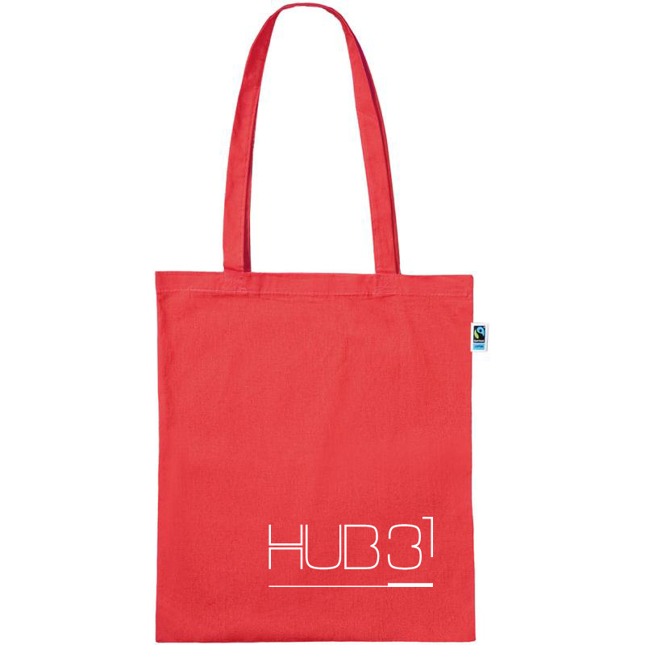
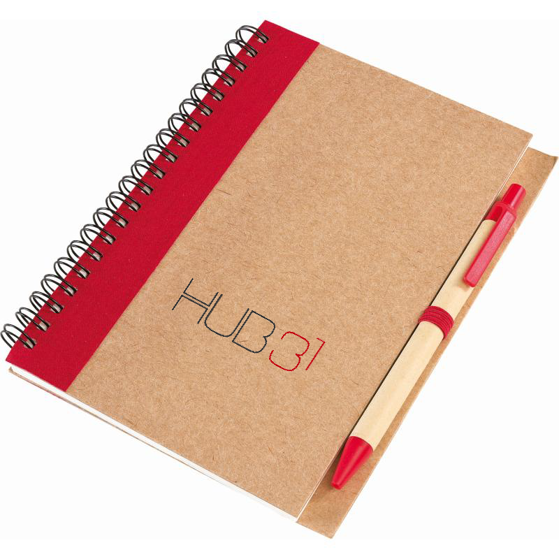
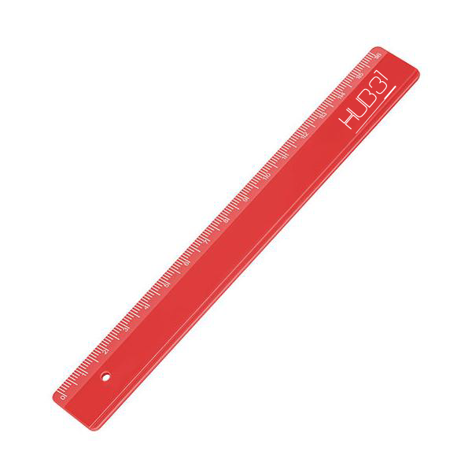
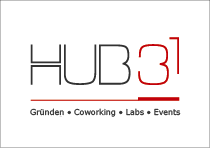
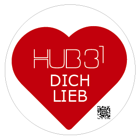
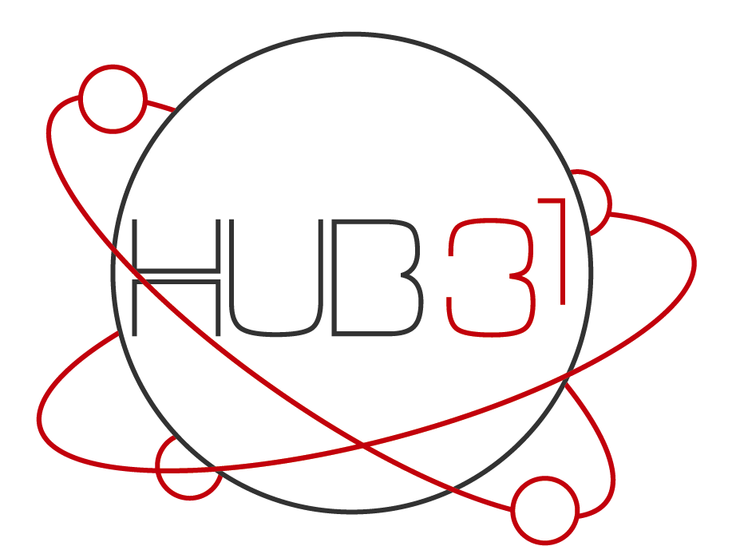
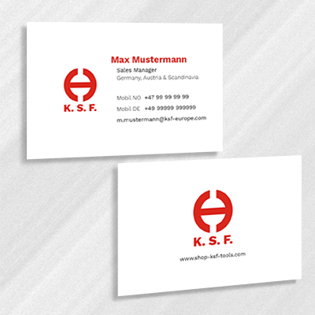
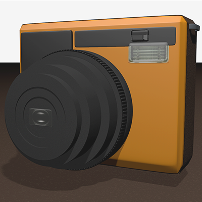
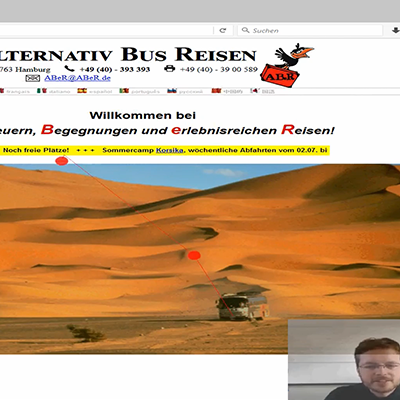

<html lang="de">
    <head>
        <!-- Required meta tags -->
        <meta charset="utf-8">
        <meta name="viewport" content="width=device-width, initial-scale=1">
    
        <!-- Bootstrap CSS -->
        <link href="https://cdn.jsdelivr.net/npm/bootstrap@5.0.1/dist/css/bootstrap.min.css" rel="stylesheet" integrity="sha384-+0n0xVW2eSR5OomGNYDnhzAbDsOXxcvSN1TPprVMTNDbiYZCxYbOOl7+AMvyTG2x" crossorigin="anonymous">
        <link href="customstyle.css" rel="stylesheet">
        <title>Aileen Bo Hededam</title>
      </head>
<body>
    <!--head--------------------------------------------->
    <h1 id="titel">Aileen Bo Hededam</h1>

    <!--intro--------------------------------------------->
    

        

            

                

            

        

    

    <!--CV--------------------------------------------->
    

        

            <h1>Lebenslauf</h1>
        

        

            

            

                <h3>Nintendo of Europe</h3>
                <h2>Praktikum Website Operation</h2>
                <h3>Okt. 2020 - März 2021</h3>
            

            

                
Management der Europäischen Nintendo Webseiten, dazu gehört sowohl die Implementierung von neuem Content und Unterseiten, als auch das Updaten sowie die Wartung. Gearbeitet wurde hauptsächlich mit dem CMS FirstSpirit.

            

            

        

        

            

            

                <h3>Hochschule Darmstadt</h3>
                <h2>Tutorin für Creative Coding</h2>
                <h3>Okt. 2018 - Sept. 2019</h3>
            

            

                
Als Tutorin habe ich Studierenden, aus dem ersten und zweiten Semester, im Fach Creative Coding geholfen. Schwerpunkt der ersten zwei Semester liegt bei JavaScript, objektorientierter- und angewandter Programmierung. Ich habe bei Problemen und Fragen bezüglich des Vorlesungsinhaltes geholfen und den Dozenten während der Übungsphasen in der Vorlesung unterstützt.

            

            

        

        

            

            

                <h3>Hochschule Darmstadt</h3>
                <h2>Interactive Media Design (B.A.)</h2>
                <h3>2017 - heute</h3>
            

            

                
Interactive Media Design ist ein projektbasierter interdisziplinärer Studiengang mit den Schwerpunkten auf angewandter kreativer Programmierung, Projektmanagement und nutzerorientiertes Design.

            

            

        

    

    <!--Skills--------------------------------------------->
    <!--<button type="button" class="btn btn-outline-light">Call to action</button>-->
    

        

            <h1>Skillset</h1>
        

        

            

                <h2>Photoshop</h2>
                <h2>InDesign</h2>
                <h2>Illustrator</h2>
                <h2>Audition</h2>
                <h2>Premiere</h2>
                <h2>CMS</h2>
                <h2>Unity</h2>
                <h2>Microsoft Office</h2>
            

        

        

            

                <h2>Prototyping</h2>
                <h2>Design thinking</h2>
                <h2>Usability</h2>
                <h2>JavaScript</h2>
                <h2>HTML</h2>
                <h2>CSS</h2>
                <h2>C++</h2>
            

        

    
      
        
    <!--portfolio--------------------------------------------->
    

        

            

                <h1>Projekte</h1>
            

            

                

                    <h1>Stallasio</h1>
                

            

            

                

                    
Stallasio ist eine Installation, die präventiv gegen die Entstehung von Massenpanik eingesetzt wird.

                

            

            

                

                    
Die Installation findet sich auf öffentlichen Veranstaltungen wieder und richtet sich an Besuchende, die kein ausgeprägtes Bewusstsein dafür haben, wie sich ihr Verhalten auf die Menschenmasse auswirkt, in der sie sich befinden. Ziel ist es, immersiv ein rücksichtsvolles Verhalten in einer Menschenmasse aufzuzeigen, um langfristig zu einer erhöhten Sicherheit beizutragen. Hierfür finden sich die Besuchenden in einer interaktiven Umgebung wieder, die sich ihrem Verhalten visuell und auditiv anpasst.

    
                    <h2>Problem</h2>
                    
In einer Stresssituation, wie einer flaschenhalsartigen Umgebung, in der leicht Massenpanik entsteht, denken viele Menschen zuerst an sich selbst. Sie haben Existenzangst und sind sich nicht bewusst, wie man sich in dieser unbekannten Situation verhält: „Schon wenige einzelne Personen, die in Panik verfallen, weinen und schreien, können andere mit ihrer Angst anstecken und eine Massenpanik verursachen.“ (Horst Berzewski, 2011)

    
                    <h2>Lösung</h2>
                    
Würden die Menschen in einer Stresssituation ruhig bleiben und sich zusätzlich rücksichtsvoll verhalten, würden andere nicht von einer Panik angesteckt werden und ebenfalls Ruhe bewahren.

                    
Die Installation trägt dazu bei, ein Bewusstsein dafür zu schaffen. Da es auf das Verhalten des einzelnen Menschen ankommt, ist die Vision, dass so viele Personen wie möglich dieses Bewusstsein erlangen. Mit einem rücksichtsvollen Verhalten muss eine Massenpanik erst gar nicht entstehen.

    
                    

                        <iframe src="https://player.vimeo.com/video/434978452" style="position:absolute;top:0;left:0;width:100%;height:100%;" frameborder="0" allow="autoplay; fullscreen; picture-in-picture" allowfullscreen></iframe>
                    

    
                    
Bei Stallasio handelt es sich um eine Installation gegen Massenpanik. Es ist ein Erlebnis, welches präventiv gegen die Entstehung von Massenpanik eingesetzt wird und ein Bewusstsein für rücksichtsvolles Verhalten schafft. Sie richtet sich an Besuchende einer Veranstaltung, welche nicht wissen, welchen Einfluss sie auf Andere haben und wie man sich bei Stresssituationen in Menschenmassen rücksichtsvoll verhält.

    
                

            

            

                

                    <a href="https://nicolashoffmann.github.io/Prototyp/P6_2020_Prototype_AIS-Cream/Build/index.html" type="button" class="btn btn-outline-light" target="_blank">
                        Teste den Prototyp
                    </a>
                

            

            

                

                    <h2>Lernings</h2>
                    <ul>
                        <li>Konzeption mit Ambient Intellegent Spaces</li>
                        <li>Remotes Arbeiten + online Kommunikation mit dem Team</li>
                        <li>C# für Unity</li>
                        <li>Shadergraphs mit Nodes in Unity</li>
                    </ul>
                

            

        

    
        

            

                

                    <h1>Marketingkonzept fürs HUB31</h1>
                

            

            

                

                    
Ein vielseitiges Marketingkonzept für das Hub31, dem Technologie- und Gründerzentrum, um Ideen und Anstöße zu geben wie das Hub31 seine Zielgruppe öfter erreicht um neue Kunden zu gewinnen. 

                

            

            

                

                    

                        
Im Gespräch mit der Geschäftsführung und den Startups, die Teil des Hub31 sind, wurde schnell klar, dass fehlende Reichweite und damit Gewinnung neuer Startups, ein aktuelles Problem des Hubs war. Zudem gab es weder genügend Budget, noch genug Zeit für ein umfangreiches Marketing. Im Zuge des XABC Seminares habe ich in einem interdisziplinären Team ein Marketingkonzept erarbeitet, welches auf die Bedürfnisse des Hub31 zugeschnitten ist und viele Vorschläge bietet. Darunter waren Konzepte für Werbeartikel, Sticker, Aufbau eines Communitygefühls, Stärkung der Webpräsenz und Beschilderung des Weges zum Hub. Um nicht den Rahmen zu sprengen, möchte ich hier die Teile es Konzepts vorstellen, für die ich hauptverantwortlich war.

        
                        <h2>Werbeartikel</h2>
                        
In einer Stresssituation, wie einer flaschenhalsartigen Umgebung, in der leicht Massenpanik entsteht, denken viele Menschen zuerst an sich selbst. Sie haben Existenzangst und sind sich nicht bewusst, wie man sich in dieser unbekannten Situation verhält: „Schon wenige einzelne Personen, die in Panik verfallen, weinen und schreien, können andere mit ihrer Angst anstecken und eine Massenpanik verursachen.“ (Horst Berzewski, 2011)

                    

                

                

                    

                        
                    

                    

                        
                    

                    

                        
                    

                

                

                    

                        <h2>Sticker</h2>
                        
Unter Beachtung der Guerilla Marketing Strategie und im Gespräch mit Vertretern des HUB31 wurde schnell deutlich, dass Sticker als ein vor allem kostengünstiges Printmedium infrage kommen. Sticker sind nicht nur universell anwendbar, sondern auch in der Produktion und Verteilung nicht sehr zeit- und kostenintensiv. 

                    

                

                

                    

                        
                    

                    

                        
                    

                

                

                    

                        <h2>Community</h2>
                        
Um die Webpräsenz des HUB31 noch weiter mithilfe von Offpage-Optimierung zu stärken, entstand die Idee, die Startups, die bereits im HUB31 aktiv sind, stärker einzubeziehen. Nach Absprache über die erlaubten Inhalte mit Vertretern des HUB31 entwarf das Team zwei verschiedene Anzeigen, die das Logo des HUB31 sowie den Satz: „Wir sind Teil des Ökosystems.“, beinhalten. Die Vertreter des HUB31 werden die Mitglieder im HUB31 darum bitten, eine dieser beiden Anzeigen auf deren Webseite, im Optimalfall als Link zur HUB31-Webseite, zu platzieren. Somit entsteht erstens ein stärkeres Gefühl von Gemeinschaft, da die beteiligten Startups ihre Zugehörigkeit zum HUB31 noch offener bekennen. Zweitens besteht hiermit auch die Möglichkeit, dass Studenten oder weitere Zielgruppen über die Webseite der beteiligten Startups auf das HUB31 aufmerksam werden. Hierfür sind außerdem keinerlei finanzielle Mittel notwendig, sondern nur die Bereitschaft der Mitglieder das HUB31 zu unterstützen. In unseren Gesprächen mit den Mitgliedern schien diese Bereitschaft gegeben zu sein. 

                        
                        <h2>Lernings</h2>
                        <ul>
                            <li>Konzeption von Werbeartikeln</li>
                            <li>Koordination eines interdisziplinären Teams</li>
                            <li>Verhandlung mit Stakeholdern</li>
                            <li>Marketinggrundlagen</li>
                        </ul>
                    

                

            

            
        

        
        

            

                

                    <h1>Nintendo Seite für “Harvest Moon: One World”</h1>
                

            

            

                

                    
Eine Gameseite ist wie eine Broschüre fürs Spiel, welche ich während meines Praktikums bei Nintendo für den Farminggameklassiker "Harvest Moon" erstellen durfte.

                

            

            

                

                    

                        
Jedes Spiel was für die Nintendo Switch erhältlich ist bekommt auf der Europäischen Nintendo Webseite ihre eigene Webunterseite. Manche Titel bekommen eine individuell gestylte Seite, die entweder von einer Agentur oder inhouse erschaffen wird. Während meines Praktikums bei Nintendo of Europe hatte ich die Möglichkeit ein solches Webprojekt für den im Frühjahr 2021 veröffentlichten Spieletitel „Harvest Moon: One World“ zu übernehmen. Durch meine im Studium erlangte Kenntnisse in HTML, CSS und JavaScript durfte ich das Projekt nicht nur managen, sondern die Seite auch selber erstellen und mich im Webdevelopement erproben. 

        
                        
Eine besondere Herausforderung an dem Projekt war, dass ich durch die Pandemie größtenteils im Homeoffice arbeiten musste und so meine Teamkollegen fast ausschließlich nur über Videocalls kannte. Dies erschwerte die Kommunikation und den Ablauf, doch konnte letztendlich gemeinsam gemeistert werden.

        
                        
                    

                

            

            

                

                    <a href="https://www.nintendo.de/Spiele/Nintendo-Switch/Harvest-Moon-Eine-Welt-1779282.html" type="button" class="btn btn-outline-light" target="_blank">
                        Schau die Seite an!
                    </a>
                

            

            

                

                    <h2>Lernings</h2>
                    <ul>
                        <li>Webdevelopment mit CMS (Firstspirit)</li>
                        <li>Projektmanagment</li>
                        <li>Webdesign</li>
                        <li>Kommunikation mit verschiedenen Abteilungen</li>
                    </ul>
                

            

        

        
        

            

                

                    <h1>Andere Projekte</h1>
                

            

            

                

                    <h3>Visitenkarte</h3>
                    
                

                

                    <h3>3D Rendering</h3>
                    
                

                

                    <a href="https://youtu.be/n-eX3cOm_Xw" target="_blank">
                        <h3>Usability testing (klicken für video)</h3>
                        
                    </a>
                

            

        

    

    

    <!--about--------------------------------------------->
    

        

            <h1>Über mich</h1>
        

        

            

            

                
            

            

                
Technik und Design sind die Leidenschaften, die mein Leben schon früh geprägt haben. So auch die Wahl meines Studiums und hoffentlich auch meine berufliche Zukunft.

                
Derzeit schreibe ich meinen Bachelor in Interactive Media Design. Dies ist ein praxisnaher und projektbasierter Studiengang, in welchem ich in jedem Fachsemester den Prozess einer Produktentwicklung durchlaufe. So gehören Problem- und Zielgruppen-Analyse, Design Thinking und Scrum Methoden, genauso zu meinem Repertoire wie Umgang mit dem Internet of Things.

                
In meinem Studium liebe ich es, immer wieder kreative und innovative Lösungen für echte Probleme zu finden, aber auch meine Präsentationsfähigkeit, kritisches Denken und eine gute Auffassungsgabe sind Stärken, die ich mitbringe. Bei der Arbeit im Team ist mir klare Kommunikation und Kollegialität besonders wichtig, aber auch, dass niemand eine Scheu hat, konstruktiv zu kritisieren.

            

            

        

    

    <!--footer--------------------------------------------->
    

        

            <a class="col-2" href="">
                <h1>Impressum</h1>
            </a>
            <a class="col-2" href="mailto:abhededam@gmail.com" target="_blank">
                <h1>Kontakt</h1>
            </a>
            <a class="col-2" href="https://www.linkedin.com/in/aileen-bo-hededam-418251184/" target="_blank">
                <h1>LinkedIn</h1>
            </a>
            <a class="col-2" href="https://www.xing.com/profile/AileenBo_Hededam/cv" target="_blank">
                <h1>Xing</h1>
            </a>
        

    

    
    
    
    
    
</body>
</html>